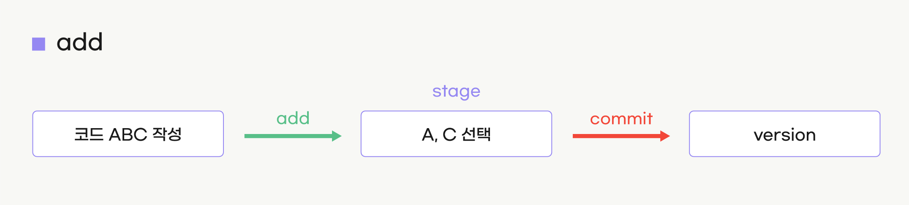

# CH04  -  원격저장소 생성 및 깃 서비스 흐름이해

 
 

## 1. Git 에서 새 레포지토리 생성하기

 

  

 

  

 
 

## 2. Add 연동 방식 - 로컬저장소에 버전 등록

  

 
 

## 3. Pull & Push 연동 방식 - 원격저장소 업로드 및 다운로드
  

  

 

  

 
     

## 4. Git Service 기본 구성 및 흐름도

